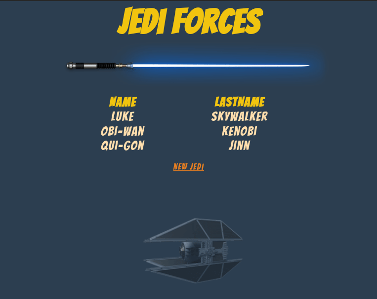

<h2 align="center">
Jedi Forces
</h2>

<p align="center">
  <a href="LICENSE" >
    
  </a>
</p>

<h3 align="center">  
  <a href="#information_source-sobre">Sobre</a> |
  <a href="#interrobang-motivo">Motivo</a> | 
  <a href="#rocket-tecnologias-utilizadas">Tecnologias</a>  | 
  <a href="#computer-como-usar">Como Usar</a> | 
  <a href="#link-como-contribuir">Como Contribuir</a> | 
  <a href="#memo-licença">Licença</a> 
</h3>

<p align="center">
    
</p>

## :information_source: Sobre

O projeto realiza o cadastro de nome e sobrenome de Jedi, os códigos deste repositório têm como referência o curso [Criando aplicações web com Spring Web MVC](https://digitalinnovation.one/cursos/criando-aplicacoes-web-com-spring-web-mvc) da plataforma [DIGITAL INNOVATION ONE](https://digitalinnovation.one/) na aula **Entendendo Spring Web MVC** .

## :interrobang: Motivo

Aprender a utilizar o framework Spring Boot.

## :rocket: Tecnologias Utilizadas

O projeto foi desenvolvido utilizando as seguintes tecnologias

- [HTML](https://developer.mozilla.org/pt-BR/docs/Web/HTML)
- [CSS](https://developer.mozilla.org/pt-BR/docs/Web/CSS)
- [Java](https://www.java.com)
- [Spring Boot](https://spring.io/projects/spring-boot)
- [Gradle](https://gradle.org/)

## :computer: Como usar

Execute o comando no terminal:
```bash
gradle bootRun
```
Acesse a url `http://localhost:8080/jedi`.

## :link: Como contribuir

- Faça um Fork do repositório,
- Faça um clone do repositório
- Crie uma branch com a sua feature
- Faça um commit com suas mudanças
- Push a sua branch
- Ir em Pull Requests do projeto original e criar uma pull request com o seu commit

## :memo: Licença
Esse projeto está sob a licença MIT. Veja o arquivo [LICENSE](LICENSE) para mais detalhes.
